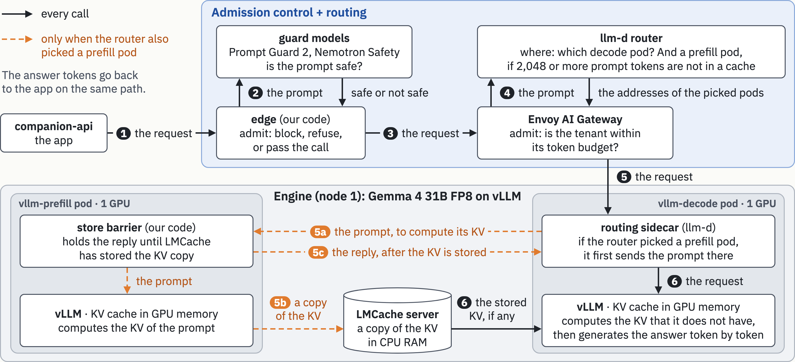
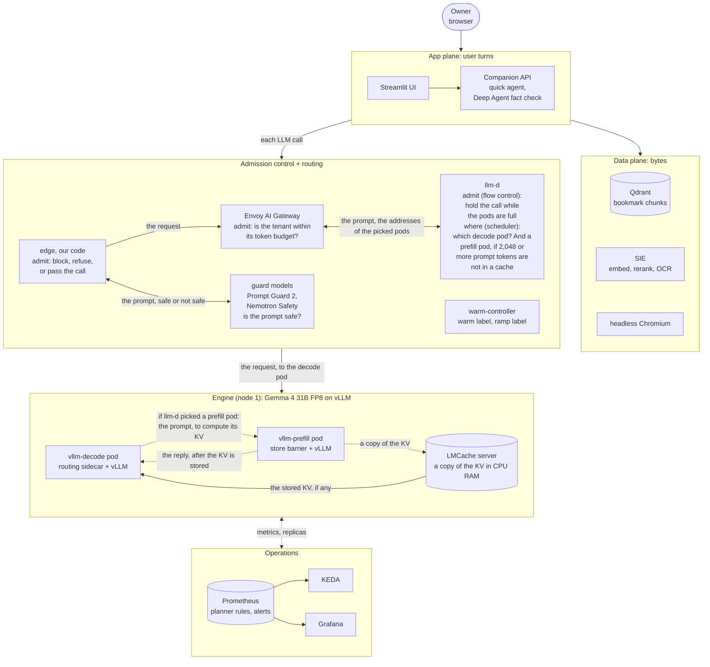

# Learning Companion on a scarce GPU

Final project for the course "AI Inference Engineering and Systems Design" (Class 11, due 2026-10-10).

The app is a learning companion over the Notion Bookmarks database of its owner. It answers questions from the bookmarks, checks volatile claims on the live web, and cites each source. Each LLM call passes admission control and routing (`edge`, the Envoy AI Gateway, and the llm-d router). Then it goes to a vLLM cluster on Lambda GPUs.

## Start here

1. `DESIGN.md`: the report. It answers the questions of the handout with our numbers, and it points at a file, a run, or a scrape for each answer.
2. `notebook/part5_queue.ipynb`: the Part 5 answers (H-65 to H-73), with plots from the runs.
3. `notebook/experiments.ipynb`: one plot or table for each experiment, and the four scarce resources.
4. `docs/results.md`: the result tables of the experiments. `tools/report_numbers.py` makes them from `metrics/`.
5. `docs/spec/09-architecture.md`: the architecture diagrams and the sequence flows.
6. `docs/spec/00-index.md`: the spec. `docs/decisions/`: the ADRs and the debate log.
7. `docs/talk/deck.pdf`: the slides of the talk (2026-10-10). `docs/talk/notes.md` has the speaker notes.

## Architecture

The path of one LLM call. This is slide 3 of the talk, and `tools/arch_diagram.py` draws it. Each box says what it decides or does, and each arrow names what moves. Solid arrows occur for each call. The orange dashed arrows occur only when llm-d also picks a prefill pod. The llm-d box shows its two jobs: its flow control is the last admit check, and its scheduler decides where.



The whole system:



`docs/spec/09-architecture.md` has more diagrams: the deployment, the KV path, and the sequence flows. The sequence flows are a quick turn, a verified turn, a split request, admission, warmup, scale-out, and the evidence of a run.

## The system in short

- Engine: vLLM v0.30.0 with `RedHatAI/gemma-4-31B-it-FP8-dynamic` on H100 SXM 80 GB. One prefill pod and one decode pod. The llm-d P/D decider splits a request with 2,048 or more uncached tokens.
- KV: the KV cache of each vLLM pod is in its GPU memory. The LMCache server keeps a copy of the KV in CPU RAM, with a cap of 250 GiB on the engine node. The hop goes through it. A store barrier in the prefill pod holds the reply until the store ends.
- Admission control + routing: `edge` does guard stage 1, admit, and stay or leave. The Envoy AI Gateway holds the tenant token windows. Then llm-d does two jobs. Its flow control is the last admit check: it holds a call while the pods are full. Its scheduler decides where: the scorers, the P/D decider, the warm gate, and the ramp.
- Overflow: `edge` can send a refused call to a hosted API (ADR-008), but the overflow was off in all runs. So a call that may leave gets a 503.
- Guard: Llama Prompt Guard 2 and NeMo Guardrails with Nemotron Content Safety, on node 2. A rejected request never reaches a serving GPU.
- App: LangChain and LangGraph Deep Agents, Qdrant, Superlinked SIE (embed, rerank, OCR), and a live web search for the fact check.
- Operations: k3s, HAMi, KEDA, Prometheus, and Grafana (nine dashboards from `tools/dashboards.py`). A spend guard enforces the GPU limits.

## The main results

- For our app traffic, two colocated replicas beat one prefill pod and one decode pod at each load (E3). The decode pod was the bottleneck, because few calls split.
- Latency (E3, H100): P/D missed both goals at each load. The goals are a TTFT p95 of at most 1.5 s, and an ITL p95 of at most 50 ms. Two colocated replicas met both at 50% load. At the client, the TPOT p50 was 32 to 51 ms with P/D, and 25 to 41 ms with colocated replicas.
- The split still protects the ITL of the other streams (E5), and short agent steps behind a long retrieve (E14).
- The LMCache hop with the store barrier took 0.5 to 0.8 s. NIXL between two pods used TCP and took about 4 s (E4).
- The llm-d flow control sheds at the door. No run preempted a request.
- The A100 runs of 2026-10-01 gave the same topology result (E3). The planner asked for the right pool, and KEDA added a pod 15 s later (E9).
- After a clear of the prefix cache, llm-d still sent warm sessions to the cleared pod, with the precise index too (E7).

`DESIGN.md` has the full list, the faults that we found, and what the data changed in the design.

## Layout

| Folder | Content |
|---|---|
| `app/` | UI, Companion API, agent, RAG, fact check, ingest, sweep, load generator, demo check. It talks only to `edge`. |
| `control/` | `edge/` (guard stage 1, admit, stay or leave), `guard/` (guard services), `router/` (llm-d router and Agent Router config), `warm/` (warm controller), `barrier/` (the store barrier). |
| `cluster/` | Lambda tools and the spend guard, k3s bootstrap, manifests and overlays, the bring-up scripts, the session scripts, and the smoke tests. |
| `images/` | The Dockerfiles of our images. |
| `metrics/` | One folder for each run: client calls, summary, run record, Prometheus queries, access logs, hop records, and nine Grafana images. Also the session logs. |
| `plots/` | The plots of the notebooks. |
| `notebook/` | The Part 5 notebook, the experiments notebook, and `proof.py` (the code of the plots). |
| `docs/` | Spec, decisions, runbooks, results, writing rules, spend ledger. |
| `tools/` | Paper math, run data, plots, the results tables, Grafana images, the writing-rules linter. |

## Commands

```bash
make check                                          # tests, lint, writing rules, manifests
uv run python tools/report_numbers.py               # docs/results.md from metrics/
uv run python tools/make_notebook.py --execute      # both notebooks, from metrics/
python3 tools/capacity.py --gpu h100-sxm-80gb       # the paper math
uv run python cluster/lambda/lambda_ctl.py plan     # Lambda stock and prices (read-only)
```

The runbooks (`docs/runbooks/`) give the bring-up and each experiment. The notebooks and the tables run from the saved files, so a reader does not need a GPU.

## Note on course material

`docs/spec/source/` holds an extract of the handout for line references. Git ignores it. Do not publish it.
