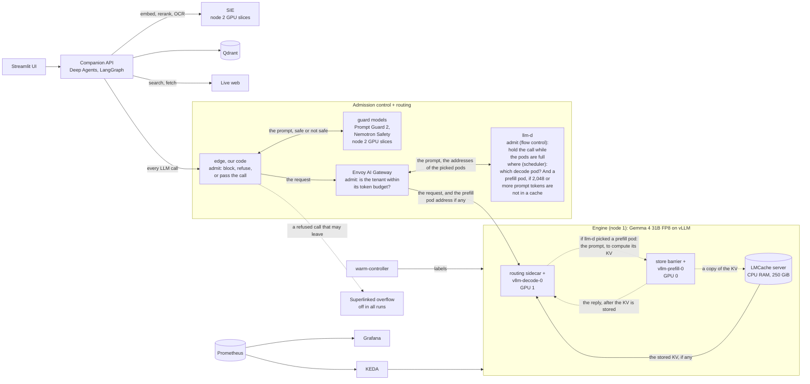
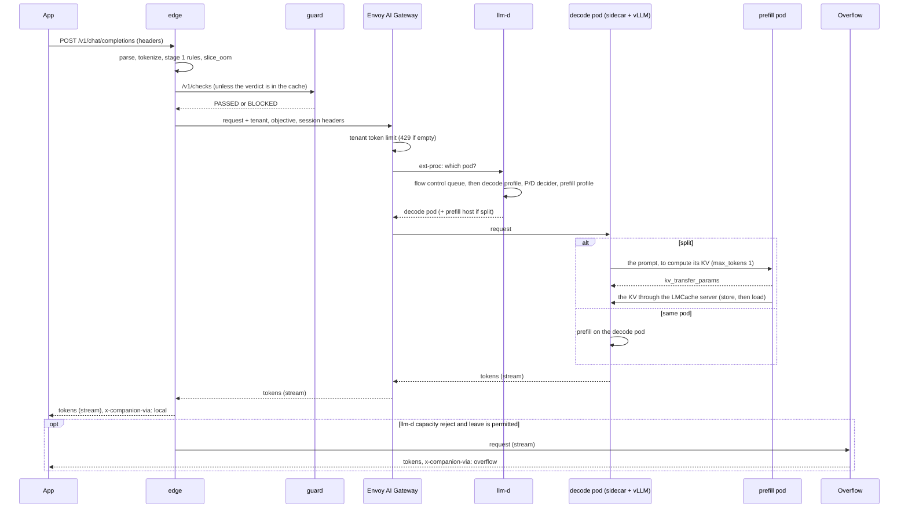

# System design

This file answers Part 2 to Part 7 of the handout. The decisions and their reasons are in `docs/decisions/` (the ADRs and `DEBATE-LOG.md`). The numbers come from `05-capacity-plan.md`.

Rule for this design: we use production components for the request path, and we own the policy. Our policy lives in their configuration, and in three small services of our own: `edge`, `guard`, and `warm-controller`. We do not write a gateway, a router, or a scheduler by hand. The handout permits existing gateways (L626), and it asks us to own the decisions (L553).

## 1. Planes, the gateway, and the engine

The handout asks for the gateway and the engine as two different parts (H-50). Our gateway is admission control + routing: `edge`, the Agent Router, and the llm-d router. The gateway admits, and the router decides where. The engine is vLLM.

| Plane | What moves | Components |
|---|---|---|
| App | user turns | Streamlit UI, Companion API (Deep Agents on LangChain and LangGraph), ingest job, sweep job, load generator |
| Data | bytes | Qdrant, SIE (embed, rerank, OCR), search API client, page fetcher, headless Chromium, Redis |
| Control | decisions | `edge` (guard stage 1, stay or leave), `guard` (NeMo Guardrails, guard stage 2), Agent Router (tenant token limits), llm-d router (flow control, place, P/D split), `warm-controller`, planner rules, KEDA, HAMi |
| GPU | tokens | vLLM prefill pool, vLLM decode pool, NIXL (inside vLLM), LMCache server (CPU tier), guard models, SIE models |

`09-architecture.md` has more diagrams: the deployment, the KV path, and the sequence flows.



## 2. Nodes and topology

We run our own k3s cluster on two on-demand Lambda instances (`DEBATE-LOG.md`, point 12). We start both nodes for a block of work, and we terminate them after it.

### 2.1 Node 1: the GPU node for the engine

| Shape | When | GPUs |
|---|---|---|
| 2 x H100 SXM 80 GB (T2) | Gate G1, sessions 1 and 2, optional live demo | GPU 0: `vllm-prefill-0`. GPU 1: `vllm-decode-0`. |
| 4 x H100 SXM 80 GB (T4) | Scale session (E9) | GPU 0 and GPU 1 as in T2. KEDA can add `vllm-prefill-1` or `vllm-decode-1` on GPU 2 and GPU 3. |

- Each vLLM pod has a full GPU, TP 1, and no HAMi hook.
- The pods carry the label `llm-d.ai/role` (`prefill` or `decode`).
- A P/D split needs two GPUs (R-01). NVLink makes the hop cheap (see the capacity plan).
- One `lmcache-server` pod (DaemonSet on GPU nodes) holds the CPU tier for all vLLM pods on the node.
- Node 1 is a k3s agent. It runs only the vLLM pods, the LMCache server, the DCGM exporter, and the node exporter.

### 2.2 Node 2: the control and data node

Shape: 2 x RTX A6000 48 GB, 28 vCPUs, 200 GiB RAM. The k3s server runs here, because GPU nodes come and go.

| Where | Pods |
|---|---|
| CPU | `edge` (2 replicas), `guard` (NeMo Guardrails server, 2 replicas), Agent Router (Envoy Gateway controller, 2 Envoy proxies, rate-limit service), llm-d router (EPP), `warm-controller`, Redis, Companion API, Streamlit UI, Qdrant, browser service (Playwright), the D-12 test page, the ingest and sweep jobs, kube-prometheus-stack, KEDA, HAMi scheduler |
| GPU 0 (HAMi slices) | `sie-embed` (12,000 MiB: `bge-m3` and `qwen3-reranker`), `sie-ocr` (10,000 MiB: the OCR model). Dev days: one dev vLLM pod (26,000 MiB). |
| GPU 1 (HAMi slices) | `guard-safety` (Nemotron 3.5 Content Safety on vLLM), `guard-injection` (Llama Prompt Guard 2). Dev days: `vllm-dev-decode`. |

### 2.3 Dev days

Only node 2 runs. `google/gemma-4-E4B-it` runs a prefill pod on GPU 0 and a decode pod on GPU 1, on HAMi slices. This tests NIXL, LMCache, the llm-d router, and the warm controller across two GPUs before the H100 sessions. For control-plane tests with no GPU, we use the llm-d vLLM simulator (`ghcr.io/llm-d/llm-d-inference-sim`, v0.11.2).

### 2.4 Layouts that we compare

Experiment E3 compares option C (our layout) with option A: two replicas, each with prefill and decode, and no hop. `DESIGN.md` reports the goodput inside SLO-1 and SLO-2 for both.

### 2.5 Network between the nodes

**VERIFY** at Gate G0: both shapes in one region, and a network path between the instances. Plan: k3s with the flannel `wireguard-native` backend, so WireGuard encrypts the traffic between the nodes. The Lambda firewall opens only SSH, and the k3s and WireGuard ports between the two node IPs.

## 3. Engine configuration

We pin one vLLM image for the engine pods: `vllm/vllm-openai:v0.30.0` (pin by digest at install). llm-d main tests v0.26.0. Gate G0 decides. If v0.30.0 fails with the llm-d router, we use v0.26.0.

| Flag | Prefill pod | Decode pod | Reason |
|---|---|---|---|
| model | `RedHatAI/gemma-4-31B-it-FP8-dynamic` | same | ADR-003. Not the FP8-block checkpoint (issue 39407). |
| `--served-model-name` | `companion` | `companion` | One name for the app. |
| `--max-model-len` | 32768 | 32768 | Our longest agent turn is below 32K. |
| `--max-num-seqs` | 8 | 24 | Decode: KV holds about 20 sequences at 24K tokens. Prefill: requests leave after the hop. |
| `--max-num-batched-tokens` | 16384 | 2560 | Prefill: large chunks for throughput. Decode: it runs prefills below the split threshold (2,048 uncached tokens) in one chunk. G1 set the lower limit: vLLM refuses a value below the largest image item of Gemma 4 (2,496 tokens). E5 tunes the chunk and the threshold together. |
| `--block-size` | same explicit value | same explicit value | Different block sizes on the two pods trigger bug 52234. |
| `--enable-prefix-caching` | on | on | The system prompt and the tool schemas are a shared prefix of about 2K tokens. |
| `--scheduling-policy` | `priority` | `priority` | `edge` sets the request priority: interactive 0, batch 10. |
| `--gpu-memory-utilization` | 0.90 | 0.90 | Space for NIXL buffers and CUDA graphs. Measure, then change. |
| `--kv-cache-dtype` | `auto` | `auto` | Experiment E6 tests `fp8`. |
| `--kv-transfer-config` | `LMCacheMPConnector`, `kv_both`, isolated IPC | same | The hop and the CPU tier: the prefill pod stores the KV in the LMCache tier, and the decode pod loads it (sidecar `shared-storage`). ADR-002 revisions 2 and 3 have the data. The prefill pod runs vLLM on 8200, behind the store barrier on 8000. The preset `nixl-hop` gives the NIXL hop. |
| `--kv-events-config` | ZMQ publisher | ZMQ publisher | The llm-d router reads the KV events for its exact prefix index. |
| `--enable-prompt-tokens-details` | on | on | The response gives `cached_tokens`. We use it for the ghost check. |
| `--tool-call-parser gemma4 --enable-auto-tool-choice` | on | on | Agent tool calls. |
| `--reasoning-parser gemma4` | on | on | Always with the tool parser (bugs 57231 and 57232). Thinking stays off by default. |
| `--limit-mm-per-prompt` | `{"image": 2}` | `{"image": 2}` | Screenshots. |
| image token budget | 560 | 560 | Gemma 4 accepts 70 to 1,120 tokens for each image. Gate G2 decides. |
| speculative decoding | off | off | MTP does not move the draft KV over NIXL (bug 54926). |

Pod settings:

- Env: `PYTHONHASHSEED=123` on every vLLM pod and on the LMCache server, so all block hashes agree. `VLLM_NIXL_SIDE_CHANNEL_PORT` unique for each pod. `UCX_TLS=cuda_ipc,cuda_copy,tcp`.
- Volumes: the Lambda filesystem holds the Hugging Face cache and the vLLM compile cache (`VLLM_CACHE_ROOT`). A second boot then skips the download and most of the compile work.
- Health: liveness `/health`, readiness `/v1/models`. Ready is not warm. The `warm-controller` sets the warm label (section 6.5).
- **VERIFY** at G1: the IPC settings that the vLLM pods and the LMCache server need on one node.

The challenger for Gate G1 (`meta-models/Muse-Glimmer-30B`) uses the same flags, with `--quantization fp8` and the `muse_glimmer` tool and reasoning parsers.

### 3.1 LMCache server (CPU tier)

- Command: `lmcache server --l1-size-gb 150 --eviction-policy LRU` (LMCache 0.5.5 or later, MP mode).
- One server for each GPU node. All vLLM pods on the node share it, and it stays when a vLLM pod restarts.
- **VERIFY** at G1: the `lmcache` version in the vLLM image is 0.5.5 or later. If not, we add it in our own image layer.

### 3.2 Guard models (node 2, GPU 1)

| Pod | Model | Server | HAMi slice |
|---|---|---|---|
| `guard-safety` | `nvidia/Nemotron-3.5-Content-Safety` (4B, BF16) | vLLM, `--max-model-len 8192`, prefix caching on, fast mode | 20,000 MiB |
| `guard-injection` | `meta-llama/Llama-Prompt-Guard-2-86M` | vLLM classify runner, or a small FastAPI service (**VERIFY** at G0) | 4,000 MiB |

The model card lists vLLM 0.11.0 to 0.20.2 for Nemotron 3.5. If our vLLM image fails with it, `guard-safety` pins v0.20.2.

### 3.3 SIE (node 2, GPU 0)

SIE runs as two servers on HAMi slices, because SIE images are bundle-specific (ADR-007). `sie-embed` uses the `default` image for `bge-m3` and `qwen3-reranker`. `sie-ocr` uses the `sglang-vision-extract` image for the OCR model. Both servers load their models at start (`--preload`). Gate G2 picks the OCR model.

## 4. Control-plane components

| Component | Version | Replicas | Job | Our code? |
|---|---|---|---|---|
| `edge` | ours (FastAPI, uvicorn, httpx) | 2 | guard stage 1, call to `guard`, `slice_oom`, headers for the router, stay or leave, overflow, streaming pass-through, shed metrics, access log | yes |
| `guard` | NeMo Guardrails 0.24.1 server | 2 | guard stage 2 through `/v1/checks`: injection check and content-safety check | config and one custom action |
| Agent Router | Envoy AI Gateway v1.1 (Agent Router) on Envoy Gateway v1.8.1 | 2 proxies | OpenAI route, tenant token limits (Redis), InferencePool backend, no retries | config |
| llm-d router (EPP) | v0.11.0, or v0.10 if the smoke test fails | 1 (**VERIFY** HA mode) | flow control, scheduling profiles, P/D decision | config |
| Routing sidecar | llm-d, in the decode pod | one in each decode pod | runs the P leg on the prefill pod, then the decode | config |
| `warm-controller` | ours (Python, Kubernetes client) | 1 | warmup routine, warm label, recovery ramp, progress check | yes |
| Planner | Prometheus recording rules | - | desired replicas for each pool | yes (rules) |
| KEDA | 2.19 | 1 | one ScaledObject for each pool | config |
| Redis | 7 | 1 | tenant token buckets (Agent Router), overflow limiter and guard verdict cache (`edge`), search cache (app) | config |

Redis starts empty in each session. A lost bucket only resets a limit.

## 5. Request path (H-80)



Step list:

1. `edge` parses the OpenAI request and our headers. It applies the chat template and counts the prompt tokens with the model tokenizer.
2. `edge` runs guard stage 1 (the rules). A rejected request gets a 4xx code and reaches no GPU (H-16).
3. `edge` checks `slice_oom`: prompt tokens plus `max_tokens` above `max-model-len` gives 413 `slice_oom`.
4. `edge` runs guard stage 2 through `guard`. A blocked request gets 400 with the rail name. It never reaches a serving GPU.
5. `edge` sets the router headers and forwards the request to the Agent Router.
6. The Agent Router applies the tenant token limit. An empty bucket gives 429 `tenant_tokens`.
7. The llm-d router queues the request in flow control, by priority band and tenant. Then it picks the pods (section 6.3). A queue timeout or a capacity limit gives 429 with the header `x-llm-d-request-dropped-reason`.
8. The routing sidecar in the decode pod runs the P leg on the prefill pod if the router chose a split. The prefill pod stores the KV in the LMCache tier. The store barrier in the prefill pod holds the P answer until the store is visible (ADR-002 revision 3). Then the decode pod loads the KV and streams the tokens.
9. If the client disconnects, the proxy closes the upstream stream. vLLM then aborts the request and frees its KV (H-72).
10. `edge` maps each reject to our codes and runs stay or leave (section 6.6).
11. `edge` writes one access-log line for each request, with every decision (JSONL). The notebook reads these lines.

## 6. The six decisions

The handout names six decisions (L553). This table shows where each one runs. The subsections give the rules.

| Decision | Where | Our part |
|---|---|---|
| Guard | `edge` (stage 1), `guard` (stage 2) | `inspect(payload) -> Guard` in `edge`, the NeMo config, the custom action |
| Admit | Agent Router (tenant windows), llm-d flow control (queue TTL, saturation), `edge` (`slice_oom`) | `should_shed` rules as config, and the reject mapping in `edge` |
| Place | llm-d router scheduling profiles | `pick` as scorer weights, one profile for prefill and one for decode |
| Queue and hop | llm-d flow control queues, the P/D decider, NIXL | band TTLs, fairness, the split threshold |
| Declare warm | `warm-controller`, router label filter | the warmup routine, the ramp |
| Stay or leave | `edge` | the overflow gate and its limiter |

### 6.1 Guard: `inspect(payload) -> Guard` (H-56)

Stage 1 runs in `edge` on the CPU. This is the first no (L536): a request that fails here reaches no GPU. The checks run in this order:

| Check | Result on failure |
|---|---|
| The model name is `companion` (or an alias in the allow list). | 400 `model_not_allowed` |
| `X-Tenant-Id` and `X-Request-Class` are present and valid. | 400 `bad_headers` |
| `max_tokens` is a positive integer. `edge` clamps it to 1024 (interactive) or 2048 (batch). | 400 `bad_max_tokens` |
| The prompt is not empty. | 400 `empty_prompt` |
| Prompt tokens are 30,000 or less. | 413 `prompt_too_long` |
| Images: 2 or fewer, PNG or JPEG, 4 MB or less each. | 413 `image_too_large` |
| Tool schemas are valid JSON Schema and 8K tokens or less. | 422 `bad_tools` |

Stage 2 has two calls that `edge` makes in parallel. The models run on node 2 GPU 1, not on a serving GPU. NeMo runs only built-in rails, so it stays on its fast engine (IORails). IORails does not run custom actions (ADR-011).

| Rail | Model | Input | Result on failure |
|---|---|---|---|
| Injection and jailbreak (`guard-injection`, our classifier service) | Llama Prompt Guard 2 86M | the new user text, in 512-token windows | 400 `prompt_injection` |
| Content safety (`guard`: NeMo `content safety check input` on IORails) | Nemotron 3.5 Content Safety, fast mode, with categories | the new user text and images | 400 `unsafe_content` with the categories |

Rules for stage 2:

1. `edge` checks only the new user content of a turn. Redis keeps each verdict by content hash for 1 hour. Later agent steps of the same turn hit the cache, but each call still passes through `inspect()`.
2. The app sends each fetched page and each OCR text to `guard` in 512-token windows. It removes or marks the windows that fail.
3. The guard fails closed. A timeout (1 s) or an error gives 503 `guard_unavailable`. That request never leaves to the overflow.
4. We do not use the NeMo jailbreak heuristics, JailbreakDetect, the self-check rails, or NemoGuard Topic Control (`DEBATE-LOG.md`, Guardrails).

### 6.2 Admit: `should_shed(req, snap) -> (shed, code, reason, retry_after_seconds)` (H-57)

Our admission rules come from the class7 table. Production components enforce them. The first rule that matches gives the result. Tenant rules come first, so a tenant limit always gives 429, even when the fleet is also full.

| Order | Reason | Where | Rule | Code to the app | Retry-After |
|---|---|---|---|---|---|
| 1 | `tenant_tokens` | Agent Router | The tenant token bucket (for each minute) is empty. | 429 | time to refill |
| 2 | `tenant_requests` | Agent Router | The tenant request bucket is empty. | 429 | time to refill |
| 3 | `slice_oom` | `edge` | Prompt tokens plus `max_tokens` exceed `max-model-len`. | 413 `slice_oom` (stays) | none |
| 4 | `no_signal` | llm-d router | No pod has fresh metrics. Unknown is not idle. **VERIFY** how the router treats stale metrics. | 503 | 1 s |
| 5 | `kv_free` | llm-d flow control, saturation detector | KV use of the candidate pods is above the limit. | 503 (router 429 mapped by `edge`) | 2 s |
| 6 | `timeout_queue` | llm-d flow control, band TTL | The request waited longer than the band TTL. | 503 (router 429 mapped by `edge`) | 2 s |
| 7 | `p99_spread` | llm-d flow control, `priority-holdback-policy` | Under saturation, the batch band waits and the interactive band goes first. | 503 for batch only | 5 s |

Why `edge` maps the router 429 to 503: since llm-d v0.9, the router uses 429 for capacity and for queue TTL. Our code rules keep 429 for tenant limits only. `edge` reads `x-llm-d-request-dropped-reason` and returns 503. A 503 may leave (section 6.6).

Map of the router reasons (llm-d v0.11.0) to our class7 reason names:

| Router reason | Our reason | May leave |
|---|---|---|
| `rejected-saturated` | `kv_free` | yes |
| `rejected-ttl-expired` | `timeout_queue` | yes |
| `rejected-no-endpoints` | `no_endpoints` | yes |
| `evicted-priority` | `p99_spread` | yes (batch stays by rule 1) |
| `evicted-queue-pressure`, `evicted` | `queue_pressure`, `evicted` | yes |
| `rejected-shutting-down` | `router_shutdown` | yes |
| `rejected-context-cancelled` | `client_gone` | no |
| `rejected-internal` | `router_internal` | no (500) |

The access log keeps the raw router reason too.

Queue TTL for each request: `edge` sets `x-llm-d-inference-ttl` to half of the time left before `X-Deadline-Ms` (class7 rule: a queue wait above half of the timeout sheds). The band TTL applies when the header is not present.

Flow-control configuration (start values, tuned in E5 and E10):

| Setting | Value |
|---|---|
| Priority bands | `interactive` (InferenceObjective priority 10) and `batch` (priority 0). Header: `x-llm-d-inference-objective`. |
| Fairness | `round-robin-fairness-policy` over the tenant. Header: `x-llm-d-inference-fairness-id` = `X-Tenant-Id`. |
| Order inside a band | `fcfs-ordering-policy`. E10 tests `edf-ordering-policy`. |
| Band TTL | interactive 10 s (half of the interactive deadline, class7 rule), batch 120 s |
| Saturation | `utilization-detector` on KV use and waiting requests for each pod |
| Usage limits | `priority-holdback-policy`: under saturation, the batch band holds back |
| Eviction | `sheddable-eviction-filter` with `priority-then-time-eviction-order-policy` |

Default tenant windows (change after Gate G1):

| Tenant | Tokens for each minute | Requests for each minute |
|---|---|---|
| `owner` | 600,000 | 300 |
| `sweep` | 300,000 | 120 |
| `load-*` | 400,000 each | 240 each |
| `noisy` | 60,000 | 60 |

### 6.3 Place: `pick(req, workers, *, policy) -> Worker | Shed` (H-58 to H-62)

The llm-d router runs `pick`. The `disagg-profile-handler` runs the decode profile first. Then the `prefix-based-pd-decider` decides the split, and the prefill profile runs only for a split. Prefill and decode use different scorers (L649). Queue depth is a scorer in both profiles.

| Step | Decode profile | Prefill profile |
|---|---|---|
| Filters | `decode-filter`, `label-selector-filter` (`companion.io/warm=true`) | `prefill-filter`, `label-selector-filter` (`companion.io/warm=true`) |
| Scorers (start weights) | `prefix-cache-scorer` 3, `session-affinity-scorer` 2, `queue-scorer` 2, `kv-cache-utilization-scorer` 2, `endpoint-attribute-weight-scorer` (ramp) 2 | `prefix-cache-scorer` 3, `token-load-scorer` 2, `queue-scorer` 2, `endpoint-attribute-weight-scorer` (ramp) 2 |
| Picker | `max-score-picker` | `max-score-picker` |

- The `precise-prefix-cache-producer` builds the prefix index from the vLLM KV events.
- The `label-producer` turns the pod label `companion.io/ramp` into the attribute that the ramp scorer reads.
- Our named policies map to scorer sets: `prefix_then_load` is the table above. `least_loaded` keeps only `queue-scorer` and `kv-cache-utilization-scorer`. `random` uses `random-picker`. E3 and E5 switch the policy by the router config.
- Do not bounce (L651, H-62): the router picks once, and the Agent Router route has no retries. `edge` never retries on another pod.
- If no pod passes the filters, the router rejects the request. `edge` returns 503.

### 6.4 Queue and hop (H-63, H-65, H-68, H-75 to H-77, H-101)

Our queue is the llm-d flow control: one queue for the pool, with priority bands and tenant fairness. It holds a request before the pod pick. vLLM keeps its own waiting queue for each pod.

The hop decision (the P/D decider):

- The decider counts the prompt tokens that are not cached on the chosen decode pod.
- If they are 2,048 or more, the request splits. The prefill pod computes the KV and stores it in the LMCache tier. The decode pod loads it (two ids, a hop).
- Else the decode pod runs the full request (same pod, no hop).
- Experiment E5 tunes the threshold.

Hop record (one line for each split, in `metrics/hops.jsonl`):

```json
{"req_id": "...", "src": "vllm-prefill-0", "dst": "vllm-decode-0", "backend": "lmcache",
 "prompt_tokens": 8123, "cached_on_dst_tokens": 2048, "transferred_tokens_est": 6075,
 "bytes_est": 1082130432, "prefix_hash": "b3f1...", "p_leg_ms": 612, "d_ttft_ms": 41, "outcome": "ok"}
```

**VERIFY** at Gate G0: the source of the hop records. First candidate: the Envoy access log with the router headers (`x-prefiller-host-port` and the destination pod), joined with the vLLM usage and the NIXL metrics.

What the hop does not copy (H-101). **VERIFY** each item in experiment E4:

1. KV blocks that the decode pod already has in its prefix cache.
2. The output token that the prefill pod made.
3. The image encoder output. The decider can keep image requests on one pod.
4. The prefix-cache blocks on the prefill pod. They stay there as cache, and LMCache keeps a copy in the CPU tier.
5. Any KV bytes through admission control and routing. The proxies move only JSON.

Failure handling:

| Failure | Action | Metric |
|---|---|---|
| The P leg fails. | The sidecar returns an error. `edge` returns 503 (no bounce). | router and sidecar errors |
| The LMCache store or load fails. | The decode pod computes the missing tokens (a slow request, not bad tokens). | `lmcache_mp_lookup_hit_tokens_total` against the requested tokens |
| The NIXL transfer fails (`nixl-hop`). | `kv_load_failure_policy: fail` gives an error, not bad tokens. | `vllm:nixl_num_failed_transfers` |
| The KV lease expires (`nixl-hop`). | The prefill pod frees its blocks. | `vllm:nixl_num_kv_expired_reqs` |
| The client leaves. | vLLM aborts the request. The lease frees the prefill blocks. | `vllm:request_success_total{finished_reason="abort"}` |
| An LMCache load fails. | vLLM computes the prefill again. Bug 57938 can stop the engine on this path. The progress check (6.5) catches it. | LMCache metrics, `orch_engine_stall_total` |

### 6.5 Declare warm (H-73, H-78, H-79, H-111)

A pod is not ready when the weights are on the GPU (H-111). The `warm-controller` keeps a state for each vLLM pod:

```text
absent -> starting -> engine_ready -> warming -> warm (ramp r10, r25, r50, r100) -> draining -> absent
```

Warmup routine (the controller calls the pod IP directly, not through the router):

1. Seed the shared prefix: one request for each active prompt version, `max_tokens: 1`.
2. Send shape probes: prompts of 1K, 4K, 8K, and 16K tokens with `max_tokens` 1 and 64. They run the code paths for chunked prefill and for the decode batch sizes.
3. For each new prefill and decode pair, send one split probe. The first hop of a new pod is slower (connections and memory registration). Experiment E8 measures its cost.
4. Send a 4K probe. If its TTFT is 1.5 x the warm baseline or less, the pod is warm. Else repeat steps 2 and 4, up to 3 times.

Then the controller sets the label `companion.io/warm=true`. The router label filter then admits the pod.

Recovery ramp (H-73): the controller sets `companion.io/ramp=r10` first. It moves the label to `r25`, `r50`, and `r100` every 10 s while the fleet TTFT p99 stays at 2 x the baseline or less. If the p99 goes above 3 x the baseline, the label goes back to `r10`. The ramp scorer gives the weights 0.10, 0.25, 0.50, and 1.00. It lowers the score of a new pod. It does not set a hard traffic share, and `DESIGN.md` says so.

Progress check (vLLM bug 53130): a pod can keep waiting requests while its generation token count stays the same. If this lasts 60 s, the controller removes the warm label and fires `EngineStalled`.

### 6.6 Stay or leave: the overflow gate (H-17, H-22, H-48)

| Local result | Decision |
|---|---|
| 200 | Stay. |
| 4xx from guard stage 1 or 2 | Stay. |
| 503 `guard_unavailable` | Stay. An unchecked request never leaves. |
| 429 from the Agent Router (tenant) | Stay. Never send a tenant 429 to the overflow (H-114). |
| 413 `slice_oom` | Stay. The overflow gives no help for our design. |
| 500 | Stay. |
| Router reject for capacity (429 with a capacity reason), 503, or 529 | Leave only if all conditions below are true. Else return 503 with the reason. |

Conditions to leave:

1. The class is `interactive`. Batch work waits and tries again later.
2. `X-Allow-Overflow` is `true` (the privacy switch).
3. The overflow limiter in Redis permits it: 20 requests each minute, 60,000 tokens each minute, 4 in flight, and 15 USD each day.
4. The request has no image.
5. The remaining deadline is longer than the overflow p50 latency.

ADR-008 names the overflow target.

## 7. KV protection, eviction, and the ghost cache (H-98, H-102)

Where we protect KV:

1. Admit: the saturation detector (`kv_free`) and the `slice_oom` rule in `edge`.
2. Place: `kv-cache-utilization-scorer` in the decode profile.
3. Queue: flow control holds requests while the saturation detector reports a full pool.
4. Engine: `max-num-seqs` and `max-model-len`. If KV still runs out, vLLM preempts the lowest-priority request and computes it again later (H-71). We count `vllm:num_preemptions_total`. We do not write our own preemption.

Where eviction happens:

| Where | What | Who decides |
|---|---|---|
| vLLM block pool (HBM) | Free blocks with a prefix hash stay as cache. vLLM reuses the least recently used free block. An evicted block goes to the LMCache CPU tier. | vLLM |
| LMCache CPU tier (150 GiB) | LRU. | LMCache server |
| Router prefix index | KV events: `BlockRemoved` and `AllBlocksCleared` remove entries. | llm-d router |

The ghost cache: the router thinks that a pod holds a prefix, but the engine already evicted it. Sticky routing then sends requests to the pod, and each request pays a full prefill (R-04). Our defenses:

1. The exact prefix index follows the KV events, so an eviction removes the entry.
2. The LMCache tier keeps evicted blocks, so a late hit costs a CPU load, not a full prefill.
3. We count the ghosts from the Envoy access log (`tools/ghosts.py`), because `edge` cannot see the prefix that the router expected. After a cache clear on pod P, a ghost is a request with three properties:
   - its session was warm on P,
   - the router sends it to P with no split,
   - it gets less than one block from the cache.

Experiment E7 clears the prefix cache on one pod. It compares the approximate prefix index (no KV events) with the exact index (KV events). The ghost count must be near zero with KV events.

## 8. Scaling: which pool and why (H-53, H-106)

Prometheus recording rules compute the desired replicas every 10 s:

```text
uncached_prefill_tokens_per_s = rate(vllm:prefix_cache_queries_total) - rate(vllm:prefix_cache_hits_total)   (prefill pods)
desired_prefill = ceil(uncached_prefill_tokens_per_s / (0.7 x prefill_tokens_per_s_per_pod))
desired_decode  = ceil(sum(vllm:num_requests_running) / (0.6 x max_num_seqs))                              (decode pods)
```

- Uncached prefill tokens drive the prefill pool. Busy decode slots drive the decode pool (L624, H-53).
- Decode has the lower threshold (0.6), so decode scales first (R-07).
- The rules export `companion:planner_desired_replicas{pool}`.

KEDA has one ScaledObject for each pool, with a Prometheus trigger on that rule (`metricType: AverageValue`, `threshold: "1"`). HPA behavior: scale up by 1 pod each 60 s, scale-down window 600 s. `minReplicaCount: 1`. We never scale an LLM pool to zero, because its warmup takes minutes. `maxReplicaCount` is 1 in T2 (no free GPU) and 2 in T4, so both pools together fit the 4 GPUs.

The scale session (E9) runs one scale-out for each pool. We record it offline: plots, the metric data, and a screen video of the "Pods / replicas / KEDA" dashboard.

## 9. Overflow target

See ADR-008. Short form: the Superlinked hosted API. The model is `qwen3.8-27b` if the hosted catalog has it. Else the model is `Qwen/Qwen3.5-4B`. The limiter is in section 6.6.

## 10. Observability

### 10.1 Metrics

| Source | Metrics |
|---|---|
| `edge` | `orch_requests_total{tenant,class,step}`, `orch_guard_reject_total{stage,reason}`, `orch_guard_seconds{stage}`, `orch_shed_total{reason,code,stage}`, `orch_overflow_total{model,reason}`, `orch_overflow_refused_total{why}`, `orch_ttft_seconds{class,route}`, `orch_request_duration_seconds{class,route}` |
| `warm-controller` | `orch_worker_state{pod,state}`, `orch_warmup_seconds{pod,phase}`, `orch_first_ttft_seconds{pod,warm}`, `orch_ramp_weight{pod}`, `orch_engine_stall_total{pod}` |
| Hop records | `orch_kv_transfer_total{backend,outcome}`, `orch_kv_transfer_tokens_total{backend}`, `orch_kv_transfer_bytes_total{backend}`, `orch_route_total{route}` |
| Planner rules | `companion:planner_desired_replicas{pool}` |
| llm-d router | flow-control queue size for each band, dropped requests by reason, scheduler picks and scores, P/D decisions |
| Agent Router | rate-limit rejects for each tenant, upstream latency |
| vLLM | `vllm:*` (KV use, running, waiting, preemptions, TTFT, ITL, prefix-cache queries and hits), `vllm:nixl_*` |
| LMCache | hit rate, stored and loaded tokens, CPU tier use |
| Other | NeMo `guard`, DCGM, HAMi, KEDA, kube-state-metrics, node exporter, Qdrant, SIE |

Our equivalent of `orch_replica_queue_depth` (Part 5): the flow-control queue size for each band (before the pick) and `vllm:num_requests_waiting` for each pod (after the pick).

### 10.2 Scrape targets

The scrape interval is 5 s for `edge`, the llm-d router, and vLLM, and 15 s for the others.

### 10.3 Dashboards (H-87 to H-94)

We write the dashboards as code (Python to JSON, as in class10). Grafana loads them from a ConfigMap.

| Dashboard | Main panels |
|---|---|
| Cluster | node CPU and memory, pods by phase, DCGM GPU use, framebuffer, power, HAMi slices |
| Success and failures | requests, 200s, sheds by code, overflow, success ratio |
| Gateway and admission | guard rejects by stage and reason, guard latency, tenant rate-limit rejects, flow-control drops by reason, `edge` latency |
| Router | picks by profile, scores, P/D split ratio, prefix hits, ghost count |
| Queue depth by pod | flow-control queue by band, vLLM waiting and running for each pod, queue wait p95 |
| vLLM | KV use, running, waiting, preemptions, TTFT, ITL, e2e, prefix-cache hit ratio, `request_success_total` by reason |
| Hop store | LMCache lookups (hit and requested tokens), stores, and CPU tier use, and `vllm:nixl_*` for `nixl-hop` |
| Pods, replicas, KEDA | desired against actual replicas for each pool, worker states, warmup time, ramp weight, first TTFT cold against warm |
| App (extra) | turn latency for each step, retrieval latency, search latency, fetch errors, OCR latency, verdict counts |

### 10.4 Four production alerts (H-105)

| Alert | Rule | Why |
|---|---|---|
| `InteractiveTTFTBudgetBurn` | Interactive TTFT p95 above SLO-1 for 5 min (multi-window burn rate). | Users feel it first. |
| `ShedRateHigh` | Shed ratio above 5% for 10 min, by reason. | Capacity is short, or a threshold is wrong. |
| `KVPressure` | Max-of-pod `vllm:kv_cache_usage_perc` above 0.92 for 5 min, or preemptions above 0.1 for each second. | The KV blocks are the scarce resource. |
| `HopFailures` | `vllm:nixl_num_failed_transfers` or `vllm:nixl_num_kv_expired_reqs` increase, LMCache load errors, or the ghost ratio is above 20%. | Silent failure in the hop or in the cache belief. |

Other alerts: `GuardUnavailable`, `EngineStalled`, `PodNotWarm` for more than 10 min, `OverflowBudget80`.

### 10.5 Traces (P1)

The app and `edge` send OpenTelemetry spans to an OTel Collector and to Tempo. Each span has a `plane` attribute (data, control, or GPU). Span names follow Case 04: `gateway.admit`, `retrieve.search`, `retrieve.embed`, `rerank.run`, `infer.prefill`, `infer.kv_wait`, `infer.decode`.

## 11. Security

We skip hardening (`DEBATE-LOG.md`, point 12). Two basic rules stay:

1. Bind the app and the control plane to localhost or the cluster network (L628, H-55). Lambda opens only SSH. We use SSH tunnels to 127.0.0.1. k3s runs with `--kube-proxy-arg=nodeport-addresses=127.0.0.1/32`.
2. Secrets (`NOTION_TOKEN`, `HF_TOKEN`, `SEARCH_API_KEY`, `OVERFLOW_API_KEY`) go into one Kubernetes Secret from the local `.env` file. They are never in Git.

The app treats fetched web text as data (see the product spec, section 6).

## 12. Tests

| Level | What | Where |
|---|---|---|
| Unit | `edge`: stage 1 rules, reject mapping, stay or leave table, overflow limiter. `warm-controller`: states, ramp, progress check. Fact-check rules (F2). Router config renderer. App clients: SIE, page check, Tavily, fetcher (robots.txt, private addresses), page reader, ingest, sweep, demo-check rules. | `control/*/tests/`, `app/tests/`, `app/factcheck/tests/` |
| App flow (no GPU) | A full user turn: the real `ChatOpenAI`, LangGraph, and Deep Agents against a fake `edge` that speaks the OpenAI API. It checks the request contract headers, the streaming rule, the answer gate, rule F2 in code, the page check, and the budgets. | `app/tests/test_agent_flow.py` |
| Rules | Planner and alert rules with `promtool test rules` | `cluster/monitoring/tests/` |
| Contract | class7 and class10 behaviors, mapped to the new components | `control/tests/contract/` |
| Integration (no GPU) | `edge`, Agent Router, llm-d router, and the llm-d vLLM simulator in k3s, with failure injection | `control/tests/integration/` |
| GPU smoke | engine smoke, P/D smoke, LMCache smoke, guard smoke, one app turn | `cluster/smoke/` |
| Load | trace replayer with the mixes (`replay.py`), the question driver for the Companion API (`questions.py`), the E1 concurrency sweep (`capacity.py`) | `app/loadgen/` |
| Fault | kill a decode pod, stale metrics, client aborts, noisy tenant, guard down | experiments E7 to E10 |
