# Architecture diagrams

This file shows the system in diagrams: the context, the planes, the deployment, the KV path, and the main sequence flows. The text and the reasons are in `04-system-design.md` and in the ADRs (`docs/decisions/`). The diagrams show the system as it ran in the sessions of 2026-09-29 and 2026-10-01.

Each diagram is Mermaid, so GitHub renders it. The names in the diagrams are the names of the Kubernetes objects and of the code.

## 1. Context

The owner uses the app in a browser. The app reads the Notion bookmarks and searches the live web. Each LLM call passes admission control and routing. Then it goes to our own vLLM engine on Lambda GPUs.

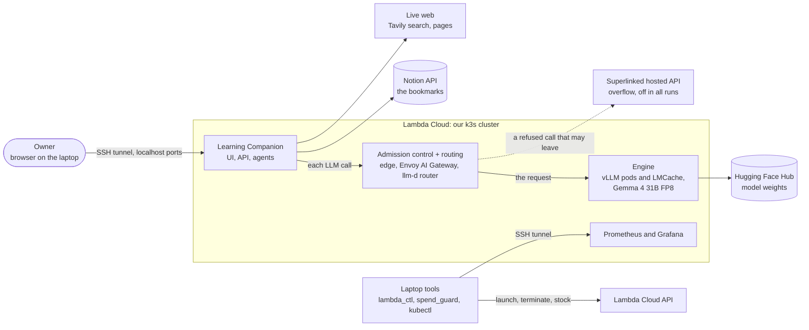

## 2. The planes

Admission control decides what enters and when it waits. Routing decides where it goes. Together they are the gateway of the handout (H-50, H-51). The engine does the work: vLLM keeps its own waiting queue, block table, preemption, and kernels (H-52).

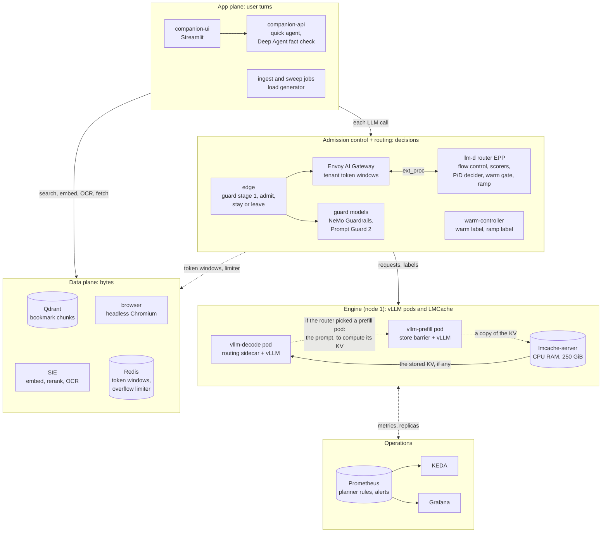

## 3. Deployment: the two-node layout

This layout ran on 2026-09-29. Node 2 was 1 x H100, because no 2 x A6000 had stock. The NodePorts listen on 127.0.0.1 only, and the laptop reaches them through an SSH tunnel.

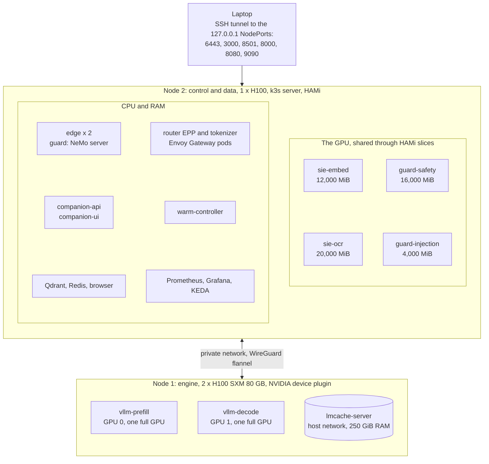

## 4. Deployment: the one-node layout

This layout ran on 2026-10-01 on 8 x A100 80 GB (ADR-005, revision 2). HAMi manages all GPUs. An engine pod asks for 100% of the cores and the memory of one GPU, so it gets a GPU that no other pod uses. The node 2 GPU pods pack onto one GPU.

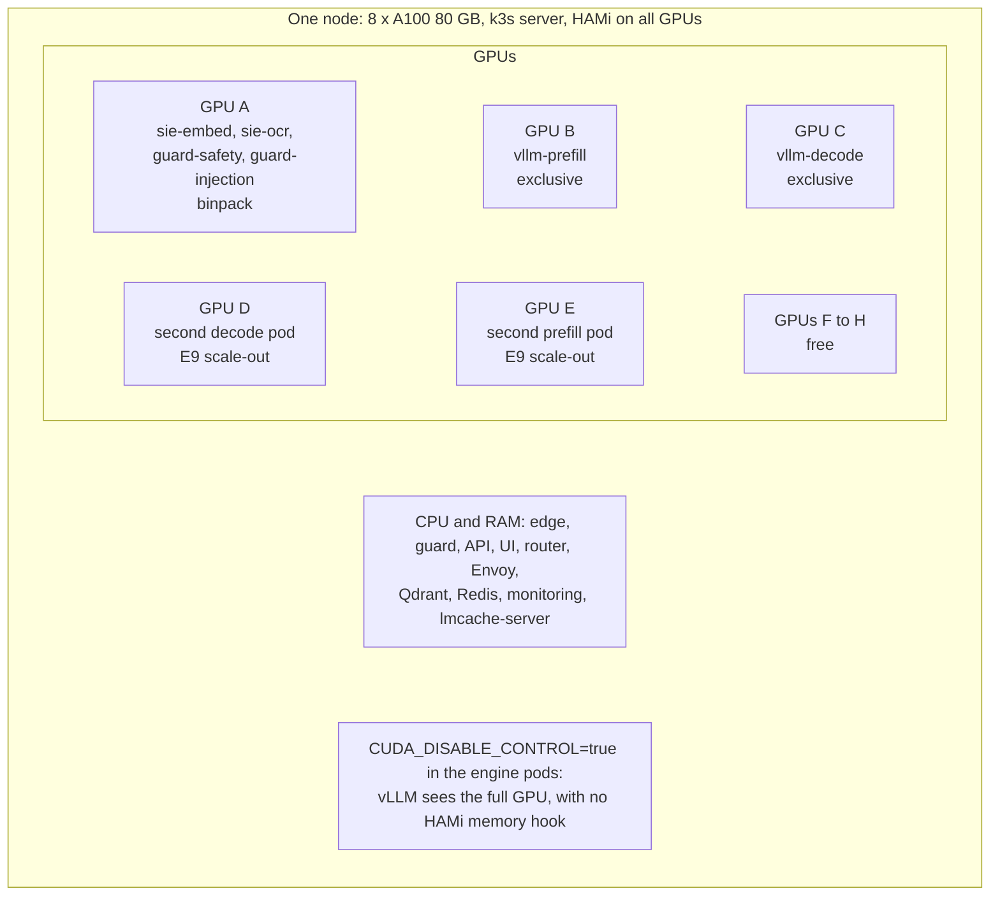

## 5. The KV path: prefix cache, hop, LMCache server, and the router index

Each vLLM pod keeps its KV cache and its prefix cache in GPU memory. Both pods use the LMCache server on the node to store and load a copy of the KV in CPU RAM. The vLLM pods publish KV events, and the router builds its prefix index from them.

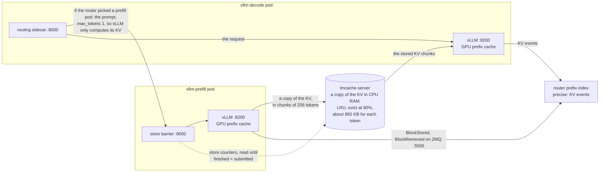

## 6. Sequence: a quick turn

A quick turn runs one agent. Each LLM call of the agent passes admission control and routing. Most calls have fewer than 2,048 uncached tokens, so the decode pod does the whole call.

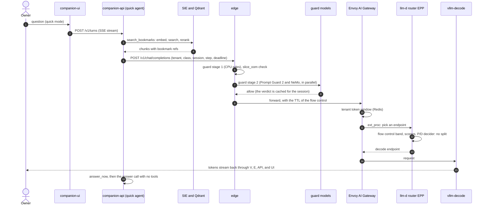

## 7. Sequence: a verified turn

A verified turn first runs the quick agent for a draft. Then a Deep Agent checks up to 3 claims of the draft against live pages. Rule F2 decides when the live result wins (ADR-012).

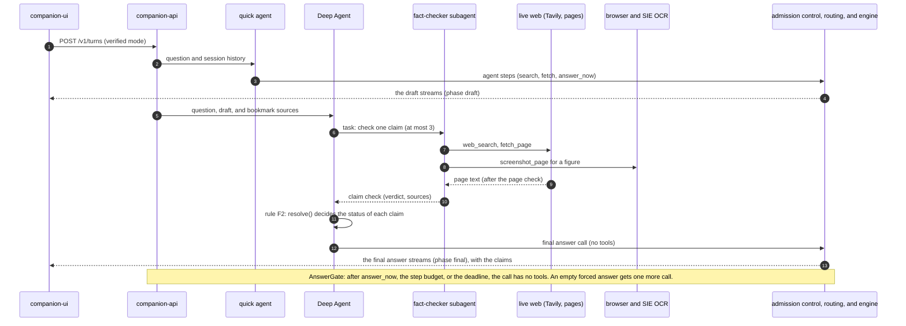

## 8. Sequence: a split request and the hop through LMCache

The P/D decider splits a request with 2,048 or more uncached tokens. The routing sidecar in the decode pod first sends the prompt to the prefill pod, with max_tokens 1. So vLLM there only computes the KV of the prompt, and the decode pod writes the answer. The store barrier holds the answer until LMCache has stored the KV (ADR-002, revision 3).

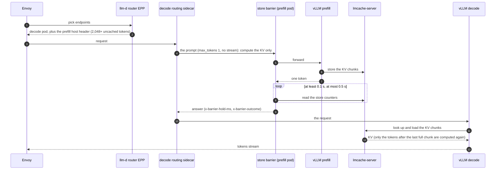

## 9. Sequence: admission and shedding

A request can stop at each stage, with a code and a reason. A rejected request never reaches a serving GPU. A capacity reject of an interactive call can leave to the overflow provider, if the call permits it. A tenant 429 never leaves. The overflow was off in all our runs, so a call that the gate let go got a 503.

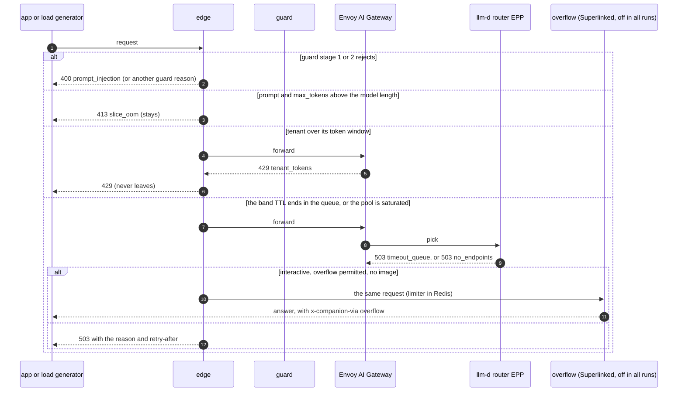

## 10. Sequence: a pod comes back, then warmup and ramp

The router sends traffic only to a pod with the warm label. The warm controller gives the label after its warmup routine, and then it raises the ramp label step by step while the TTFT p99 holds.

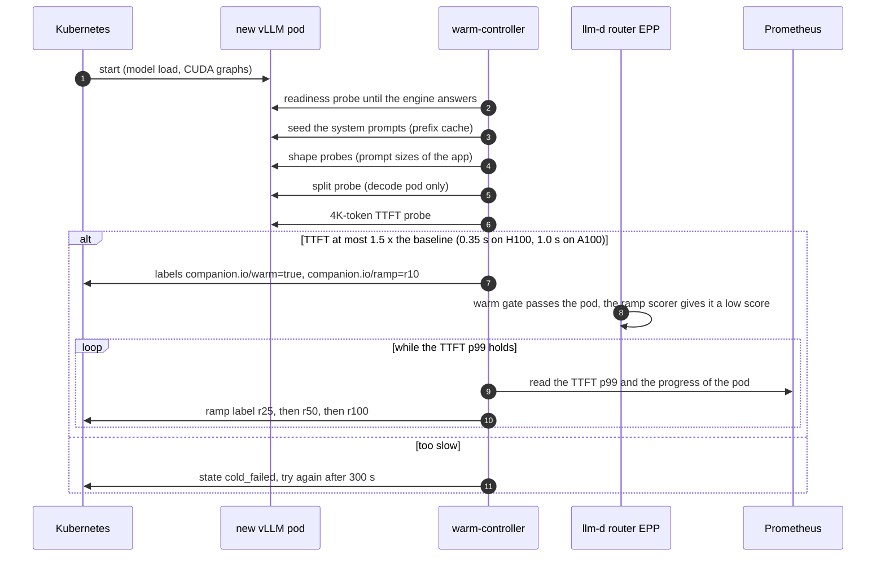

## 11. Sequence: scale-out of a pool

Prometheus recording rules turn the load signals into the replicas that each pool needs (`cluster/manifests/base/monitoring/rules.yaml`). KEDA reads them. The decode pool scales on busy sequences. The prefill pool scales on uncached prefill tokens.

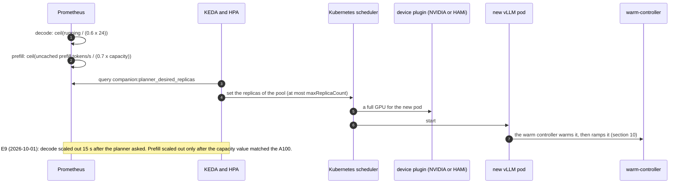

## 12. Sequence: a measurement run and its evidence

Each run saves the same evidence, so each number in `DESIGN.md` has a source.

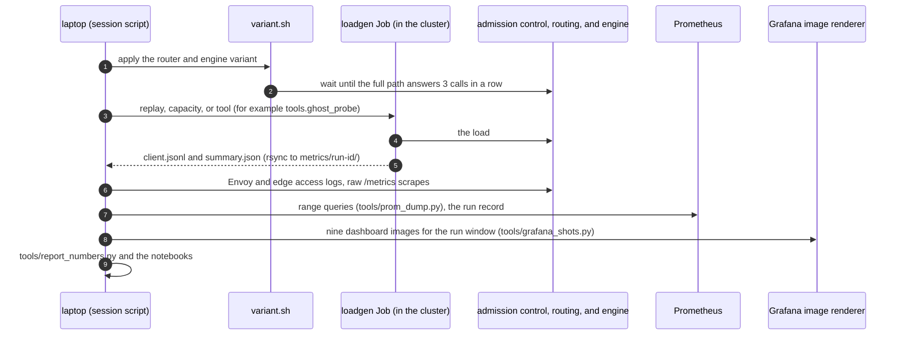

## 13. Operations: launch, spend, and teardown

The launch tool and the spend guard enforce the approvals of the owner. These are the day plan, the launch window, the hour limits, and the USD limit. We report each launch and each terminate step at once, and we record it in `docs/budget-ledger.md`.

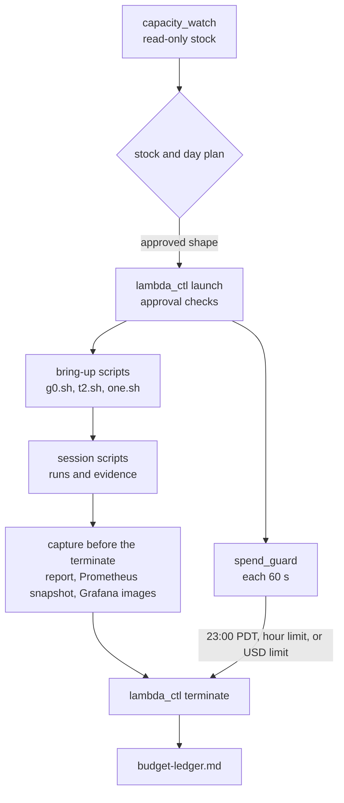
