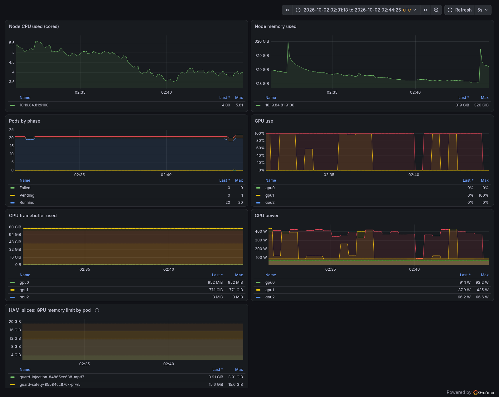
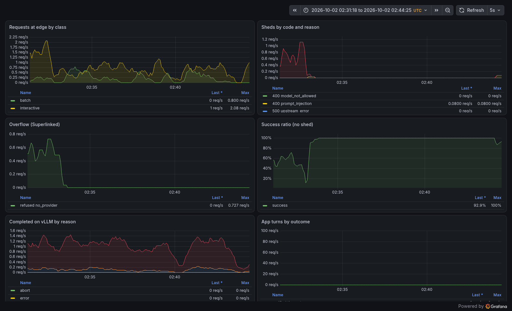
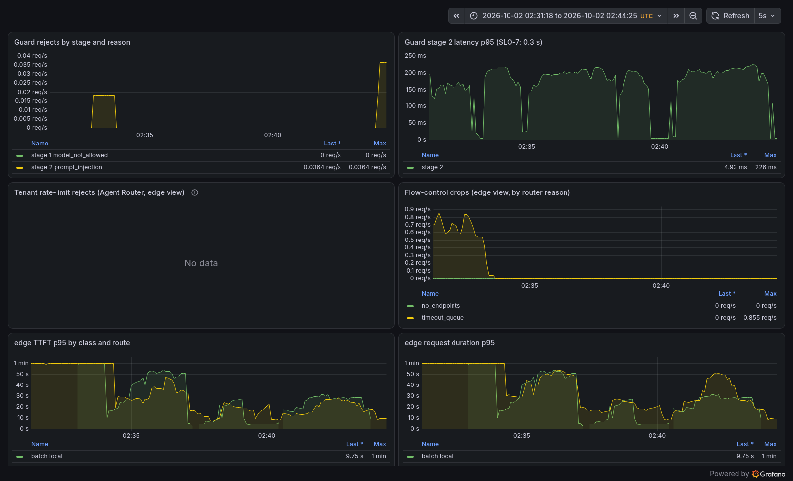
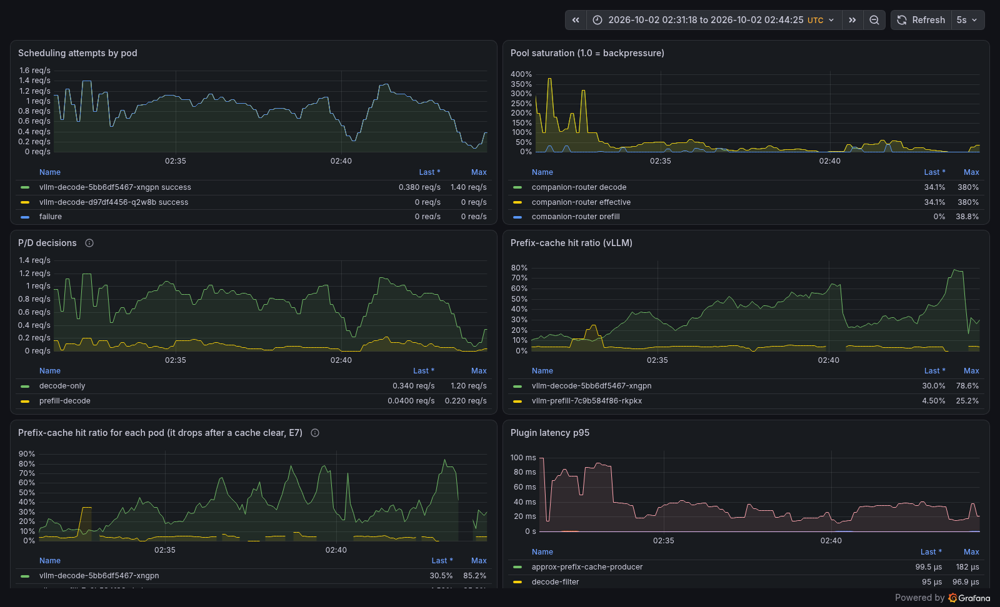
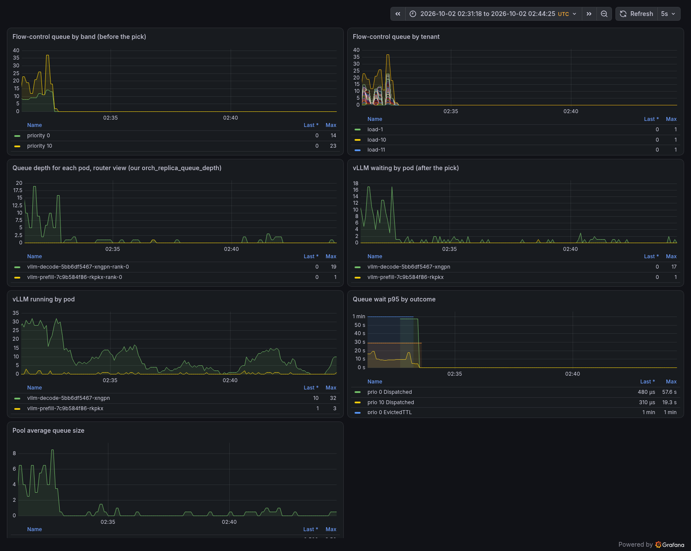
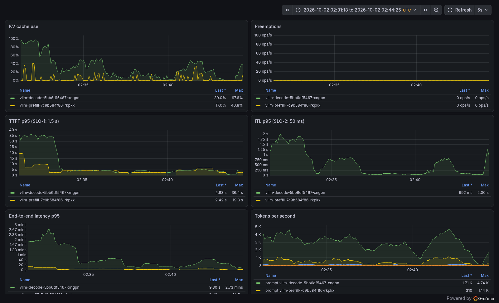
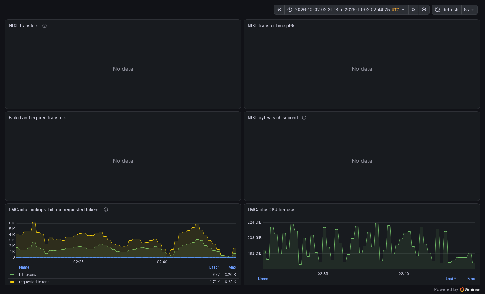
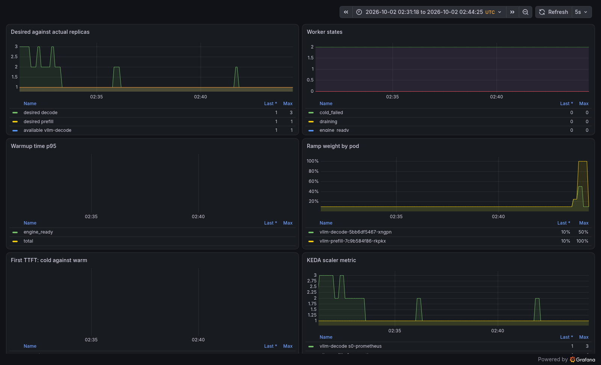
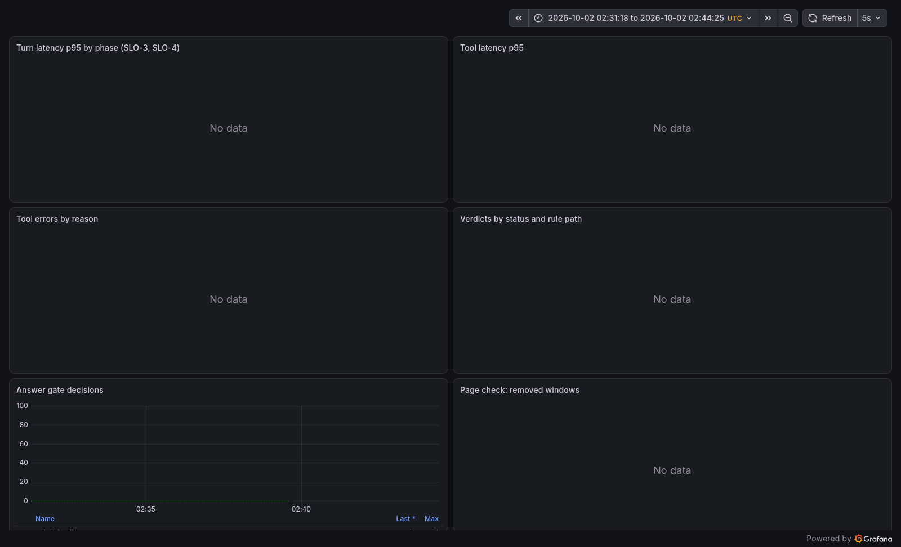

# Grafana walk: e3-c32-r015

Window: 2026-10-02 02:31:18 UTC to 02:44:25 UTC.

## Cluster

## Success and failures

## Gateway + admission: sheds by reason

## Router

## Queue depth by pod

## vLLM

## KV hop store (NIXL and LMCache, our Mooncake)

## Pods / replicas / KEDA: which pool?

## The Companion app (not in the handout list)

